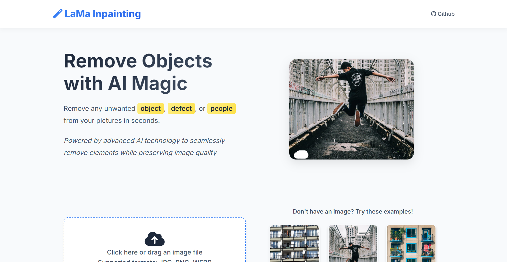
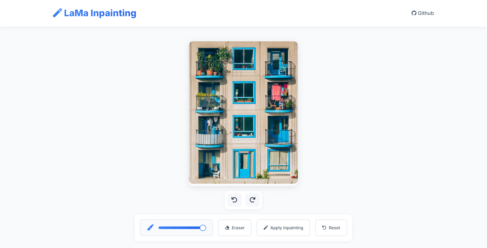

# Inpainting Web App with LaMa Model

This repository provides a web-based **image inpainting tool** built with **Flask**, allowing users to upload an image, draw masks on it, and apply an AI-based inpainting model to intelligently fill in the masked regions.

---

## 📌 Overview

- Web interface for interactive inpainting
- Built on top of the **LaMa** model
- Supports multiple inpainting versions with undo/redo
- Masks are drawn directly in the browser
- Local demo – no need to upload images to external servers

---

## ✨ Demo




---

## 🔍 Model Used

This project uses the **LaMa** model, proposed in:

> **"Resolution-robust Large Mask Inpainting with Fourier Convolutions"**  
> [Roman Suvorov et al., 2021](https://arxiv.org/abs/2109.07161)

Official implementation:  
👉 https://github.com/advimman/lama

We **use their pre-trained weights** (specifically `big-lama`) for inference.  
---

## 🚀 Getting Started

1. **Clone repository:**

```bash
git clone https://github.com/dattrieuK17/inpainting.git
cd inpainting
```

2. **Create virtual enviroment and install dependencies:**

```bash
python -m venv venv
source venv/bin/activate  # Trên Windows: venv\Scripts\activate
pip install -r requirements.txt
```

3. **Pre-trained LaMa Weights**
    Download big-lama from the LaMa repo and place it in:
```
inpainting/
└── LaMa_models/
    └── big-lama/
        ├── config.yaml
        └── models/
            └── best.ckpt
```

3. **Run**
```bash
python run.py
```

4. **Access:**
    Open your browser and access to `localhost:5000`
